# Chit Chat - Messaging Service

<table>
  <tr>
    <td>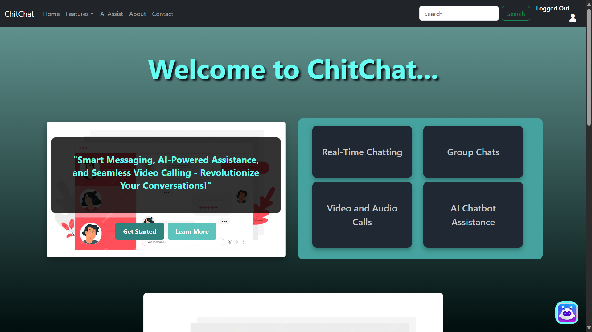</td>
    <td>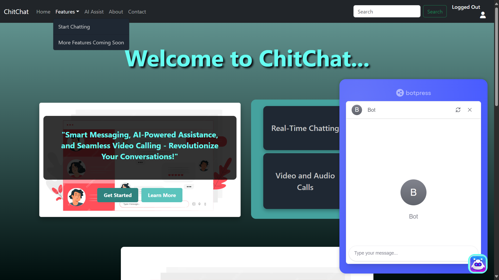</td>
  </tr>
</table>
<table>
  <tr>
    <td>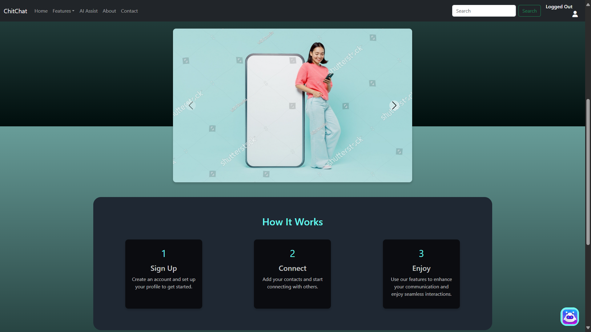</td>
    <td>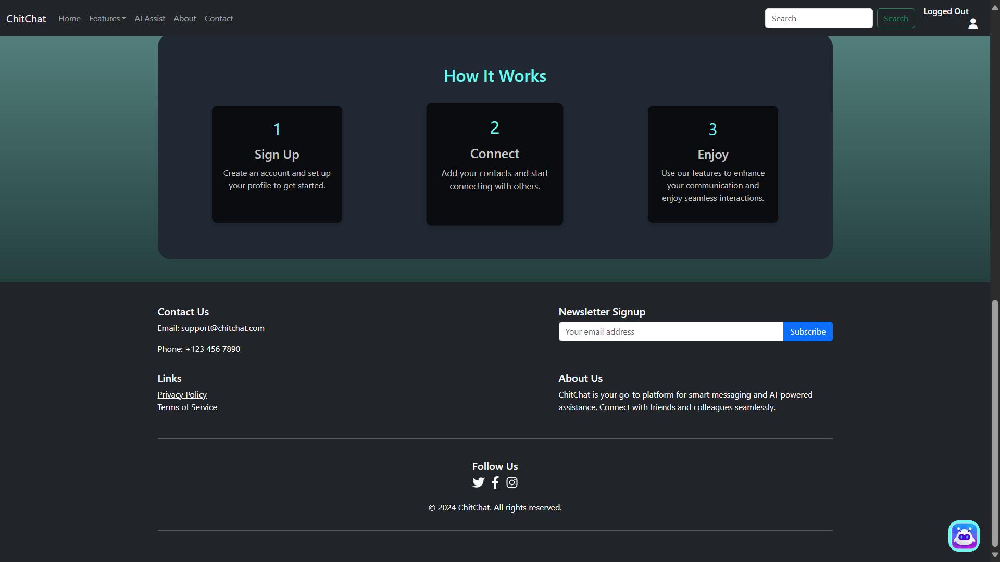</td>
  </tr>
</table>

## Author
**Adarsh Dhakar**  
IIT Bhubaneswar  
Computer Science and Engineering

## Documentations
- [System Design Document](./docs/System_Design_Document.md)
- [Setup and Run Instructions](./docs/Setup_and_Run_Instructions.md)
- [Dependencies and Libraries](./docs/Dependencies_and_Libraries.md)
- [Deployment Instructions](./docs/Deployment_Instructions.md)
- [Future Improvements](./docs/Future_Improvements.md)

## Description
Chit Chat is a messaging service prototype that allows users to register, send and receive messages, and participate in group chats in real time. 
The application includes optional features like an AI-powered chatbot and video calling.

## Technology Stack
- **Frontend:** Next.js
- **Backend:** Node.js
- **Database:** MongoDB
- **Authentication:** Passport.js
- **File Storage:** Cloudinary
- **Real-time Communication:** Socket.io
- **Audio/Video Calls:** WebRTC
- **AI Chatbot:** Botpress

## Features
### Core Features
- User registration and authentication
  <table>
  <tr>
    <td>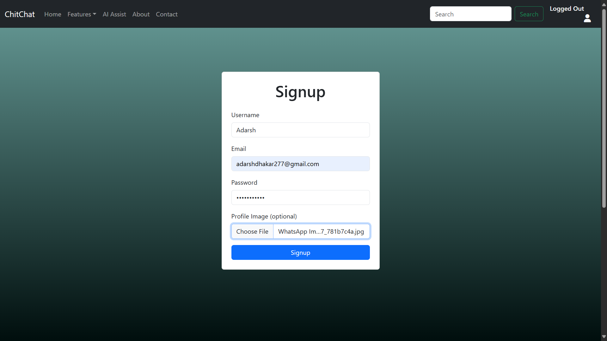</td>
    <td>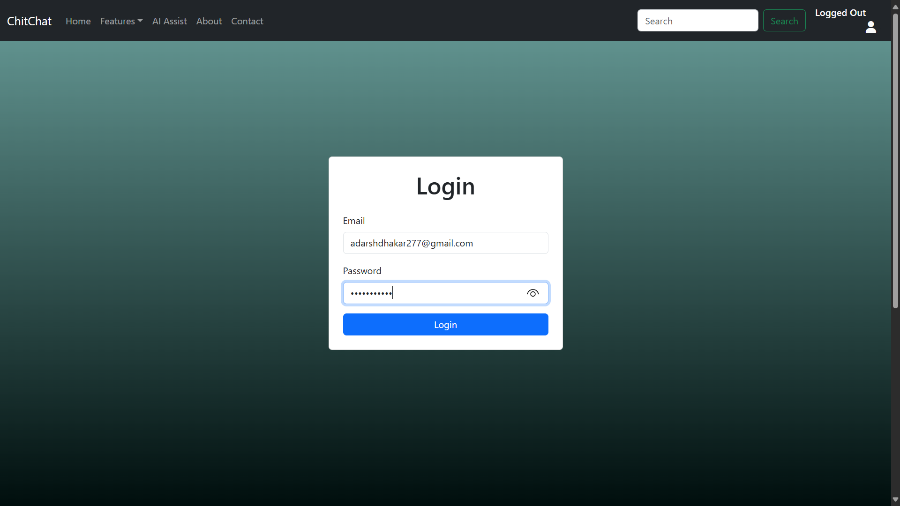</td>
  </tr>
</table>
- Sending and receiving text messages
- Group chat functionality
  <table>
  <tr>
    <td>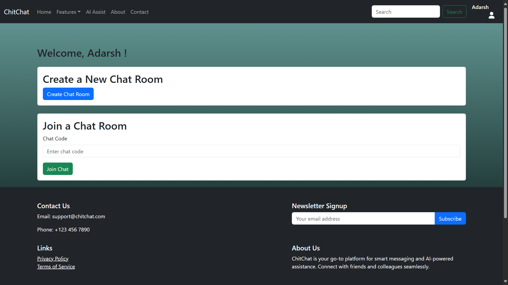</td>
    <td>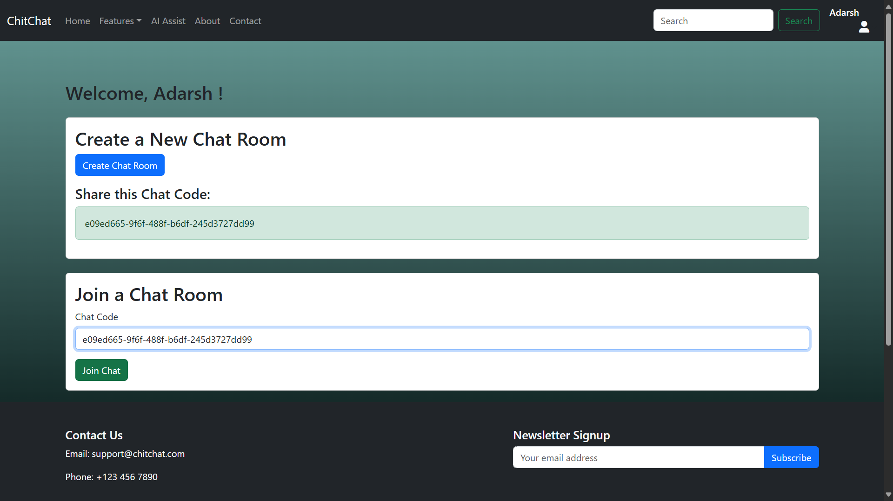</td>
  </tr>
</table>
  <table style="width:100%; text-align:center;">
  <tr>
    <td>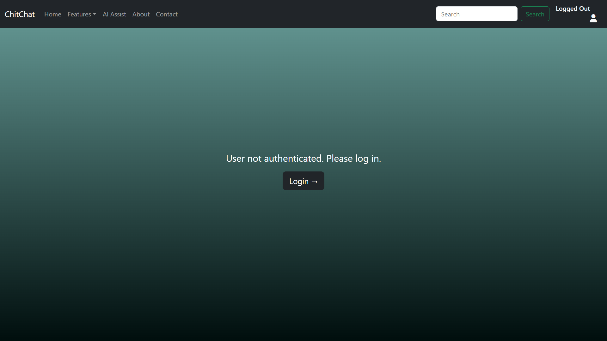</td>
  </tr>
</table>
- Real-time message updates
  <table style="text-align:center;">
  <tr>
    <td>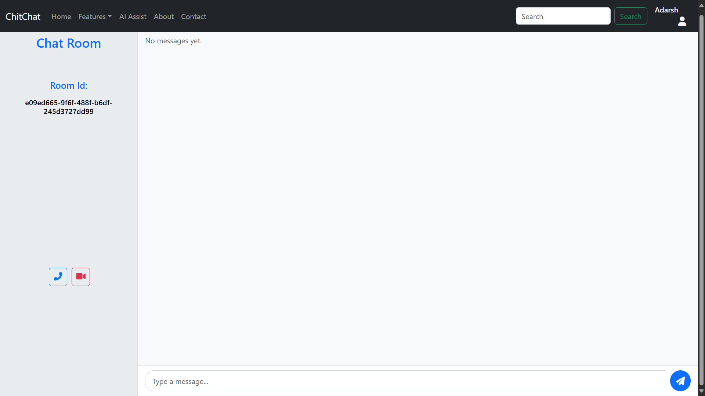</td>
    <td>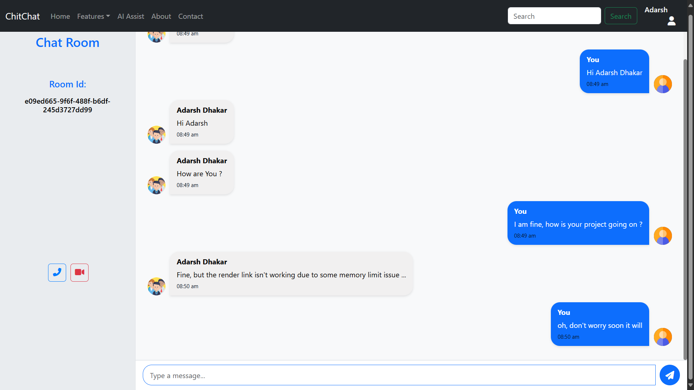</td>
  </tr>
</table>
  <table style="width:100%; text-align:center;">
  <tr>
    <td>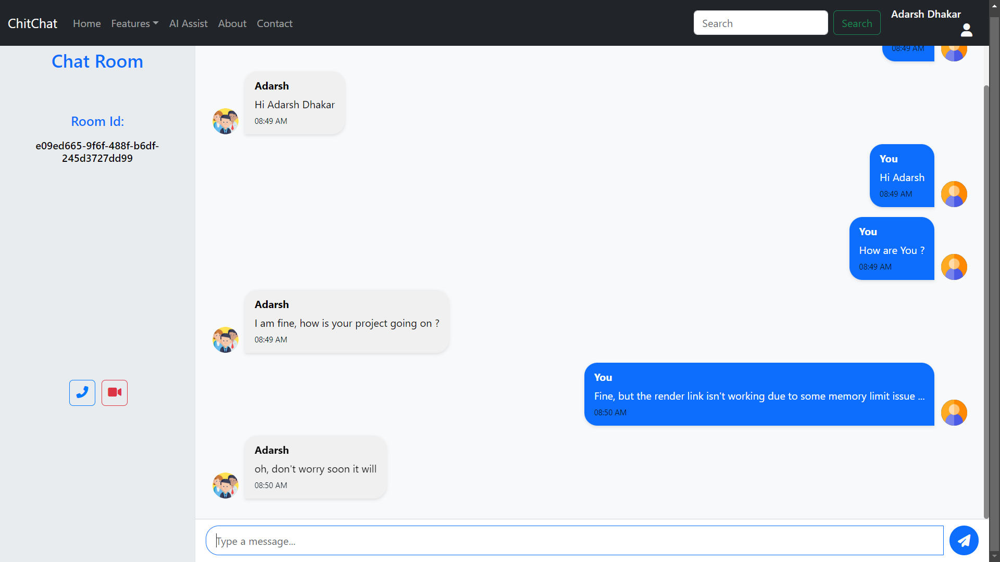</td>
  </tr>
</table>
- AI-powered chatbot
  <table style="width:100%; text-align:center;">
  <tr>
    <td>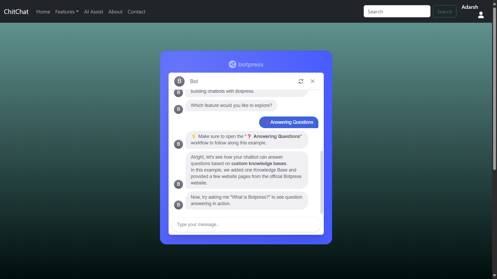</td>
  </tr>
</table>
- Video/Voice calling
  <table style="width:100%; text-align:center;">
  <tr>
    <td>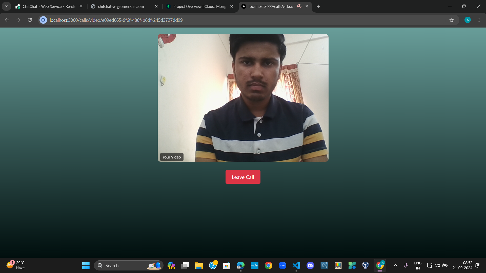</td>
  </tr>
</table>
- About and Contact Us Section
<table>
  <tr>
    <td>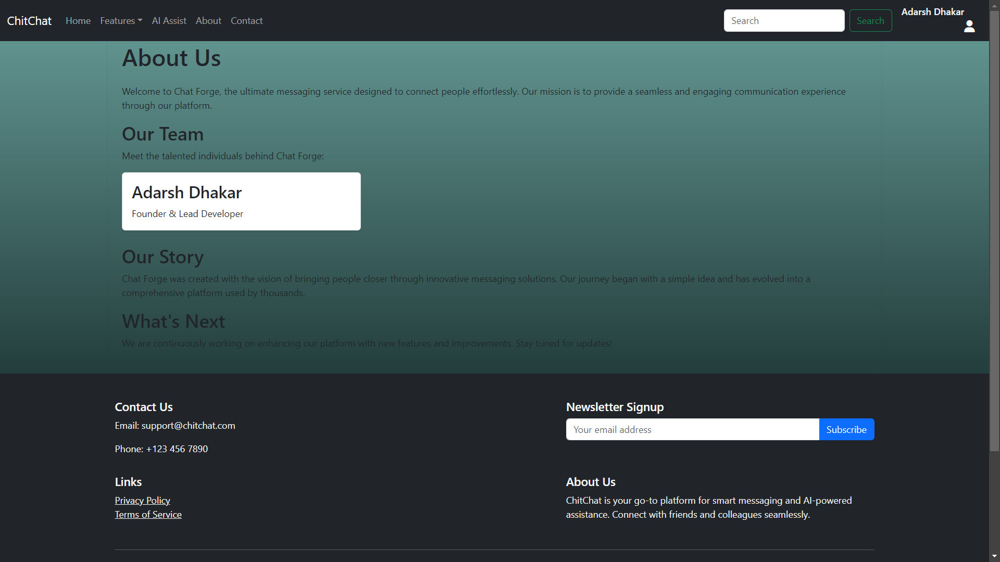</td>
    <td>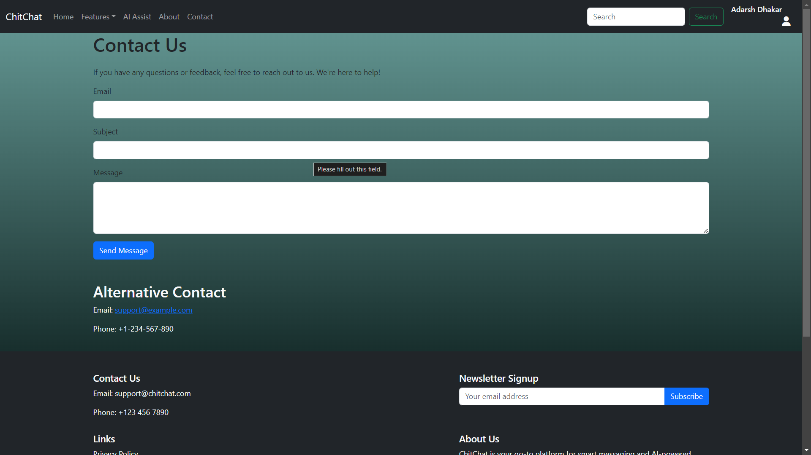</td>
  </tr>
</table>

## System Design
For a detailed system design, refer to the [System Design Document](./docs/System_Design_Document.md).

## Setup Instructions
1. Clone the repository:
   ```bash
   git clone https://github.com/adarshdhakar/ChitChat.git
   cd ChitChat

2. Install dependencies:
    ```bash
    npm install

3. Configure environment variables (create a .env file):
- NEXT_PUBLIC_SOCKET_URL=<http://localhost:3000>
- NEXT_PUBLIC_API_URL=<http://localhost:5000>
- CLOUDINARY_CLOUD_NAME=your-cloudinary-cloud-name
- CLOUDINARY_API_KEY=your-cloudinary-api-key
- CLOUDINARY_API_SECRET=your-api-secret
- EMAIL_USER=your-gmail-id
- EMAIL_PASS=your-gmail-app-password
- ATLASDB_URL=your-atlasdb-url
- SECRET=your-session-secret

4. Run the application:
    ```bash
    npm start

The application will be available at http://localhost:3000.

## Deployment
This application is deployed on (https://render.com). You can access it at (https://chitchat-wryj.onrender.com/).

## API Endpoints
### Authentication
- Login: POST /api/auth/login
- Signup: POST /api/auth/signup
- Logout: POST /api/auth/logout

### User Profile
- Get User Profile: GET /api/users/:userId
- Upload Profile Picture: POST /api/users/:userId/profile-picture

### Chats
- Create Chat: POST /api/chats

### Voice & Video Calls
- Initiate Voice Call: POST /api/calls/voice
- Initiate Video Call: POST /api/calls/video

### Dependencies
- Next.js: For server-rendered React applications.
- Node.js: For server-side programming.
- Express: To handle API requests.
- Mongoose: For MongoDB object modeling.
- Passport.js: For user authentication.
- Socket.io: For real-time messaging.
- Cloudinary: For image uploads.
- Multer: For handling multipart/form-data.

- Web RTC: For voice and video calls.
- Botpress: For chatbot training and publishing.

## Future Improvements
- Add end-to-end encryption for messages.
- Implement user blocking and reporting features.
- Enhance the AI chatbot's capabilities.

## Contact
For any inquiries, please email:

chitchathelpdesk@gmail.com

or 

adarshdhakar277@gmail.com
